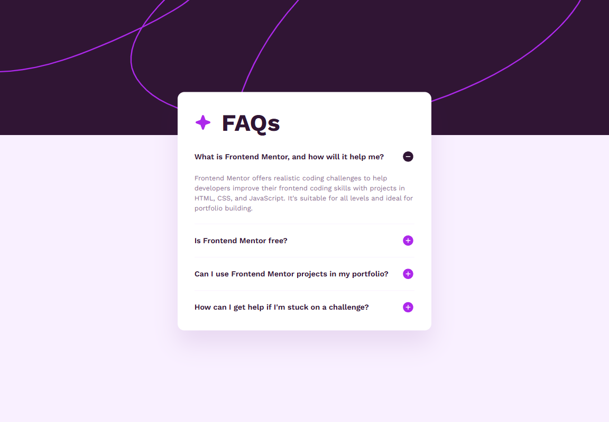
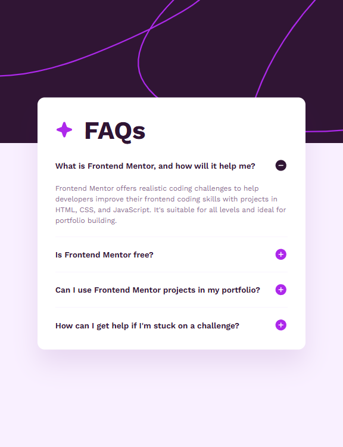
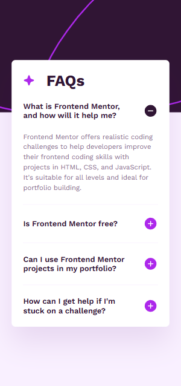

# Frontend Mentor - FAQ accordion solution

This is a solution to the [FAQ accordion challenge on Frontend Mentor](https://www.frontendmentor.io/challenges/faq-accordion-wyfFdeBwBz). Frontend Mentor challenges help you improve your coding skills by building realistic projects.

## Table of contents

- [Overview](#overview)
  - [The challenge](#the-challenge)
  - [Screenshot](#screenshot)
  - [Links](#links)
- [My process](#my-process)
  - [Built with](#built-with)
  - [What I learned](#what-i-learned)
  - [Continued development](#continued-development)
  - [Useful resources](#useful-resources)

## Overview

### The challenge

Users should be able to:

- Hide/Show the answer to a question when the question is clicked
- Navigate the questions and hide/show answers using keyboard navigation alone
- View the optimal layout for the interface depending on their device's screen size
- See hover and focus states for all interactive elements on the page

### Screenshot





### Links

- Solution URL: [https://github.com/skhbabez/faq-accordion-main](https://github.com/skhbabez/faq-accordion-main)
- Live Site URL: [https://skhbabez.github.io/faq-accordion-main/](https://skhbabez.github.io/faq-accordion-main/)

## My process

### Built with

- Semantic HTML5 markup
- CSS custom properties
- Flexbox
- CSS Grid
- Mobile-first workflow

### What I learned

This was the first time I really built an accordion and it surprised me how simple it is using details/summary elements. This also made making it accessible quite simple, as I could mostly leverage semantic HTML. Especially styling the markers turned out to be straightforward and entirely doable with only CSS.

```css
& details {
  &[open] {
    --check-icon: url("assets/images/icon-minus.svg");
  }
}
```

I struggled most with the background as I wanted to make sure the image essentially has cover set as fit setting. I wanted to make sure it resized naturally without swallowing up the screen. I used a ::before on the body, setting it to a negative z-index. Position fixed ensured it was not messing with my layout, especially the grid I used for positioning my accordion card.

```css
body::before {
  content: "";
  block-size: 14.5rem;
  inline-size: 100%;
  left: 0;
  top: 0;
  position: fixed;
  background-image: url("assets/images/background-pattern-mobile.svg");
  background-size: cover;
  background-repeat: no-repeat;
  z-index: -1;
  @media (min-width: 48em) {
    block-size: 20rem;
    background-image: url("assets/images/background-pattern-desktop.svg");
  }
}
```

### Continued development

I used Axe developer tools to test the accordion and did some manual testing with nvda, but I personally want to build some kind of better accessibility testing flow. I also still need to learn more about the accessibilty object model and how to interpret it better. Otherwise I think this turned out quite well.

### Useful resources

- [details and summary](https://web.dev/learn/html/details) - Helpful web dev article for styling details and summaries.
